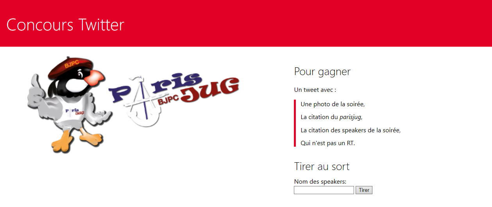
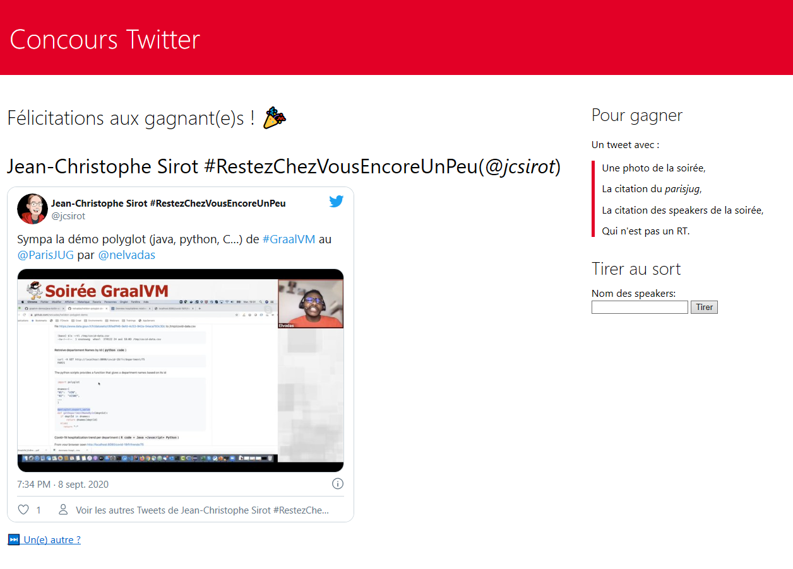

# Paris JUG Twitter raffle website

This website is the Twitter raffle to gift our sponsor prizes.




## Package

Compile project with Maven:

```bash
mvn package
```

## Run

Run providing Twitter client credentials using CLI arguments:

```shell
java -Dtwitter4j.oauth.consumerKey=<consumerKey> -Dtwitter4j.oauth.consumerSecret=<consumerSecret> -Dtwitter4j.oauth.accessToken=<accessToken> -Dtwitter4j.oauth.accessTokenSecret=<accessTokenSecret> -jar target/twitter-raffle-1.0.0-SNAPSHOT-runner.jar
```

Run providing Twitter client credential using environment variable 

```shell
export twitter4j.oauth.consumerKey=<consumerKey>
export twitter4j.oauth.consumerSecret=<consumerSecret>
export twitter4j.oauth.accessToken=<accessToken>
export twitter4j.oauth.accessTokenSecret=<accessTokenSecret>
java -jar target/twitter-raffle-1.0.0-SNAPSHOT-runner.jar
```
